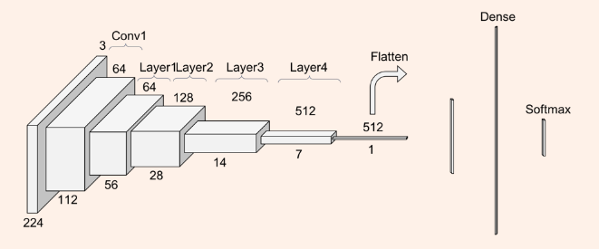

# Automatic Detection of Autism Spectrum Disorder 

A Deep Learning Model To Predict Autism from Brain MRI Scans

## Objective Summary

Autism spectrum disorder (ASD) is a developmental disability caused by differences in the
brain. People with ASD have problems with social communication and interaction and
restricted behaviors or interests. In the current research, deep learning models are being
created to help solve the issue of predicting autism in people. In our project, we hope to do
the same – accurately predicting if a patient has autism by developing a deep neural
network model that trains on the patient’s brain MRI scans. However, our project differs
because we will use the midsagittal section of the MRI scans along the amygdala, the
orbitofrontal cortex, the cerebral cortex, and the insula sections of the brain. This
fundamental difference between our project to current research will help prepare a model
to predict autism more accurately from our selected sample data.


## Setup
Setting up the virtual environment will be the first and foremost task to do before running the scrappers. This will help in installing the required packages used in the python code. A [requirements](requirements.txt) file has been added in the root directory which includs all the dependencies that should be installed on the virtual environment. Failing to do so might result in errors in codes. Following is a way to create the virtual environment and install all requirements on it.

```console
$ python3.10 -m venv venv
$ source venv/bin/activate
$ pip install -r requirements.txt
```
## Methodology 
Recently, many efforts have been made to identify ASD based on deep learning with fMRI. A deep neural network model was investigated to build a subject-transfer decoder. 
The stereotypical motor movements in autism patients are body rocking and complex hand movements. The CNN is used to learn different features from multi-sensor accelerometer signals of SMM in 2015.
In 2017, multivariate and high dimensional data are reduced to two-dimensional features, and the functional connectivity pattern associated with ASD is investigated by using a variational autoencoder (VAE).
A fully automated brain tumor segmentation method using CNN was proposed in 2017.
In 2018, two stacked denoising autoencoders was employed to extract a lower-dimensional version of the ABIDE I dataset and identified the areas of the brain that played the most important role in differentiating ASD from typical controls.
The volumetric convolutional neural network model, which is considered as the full-resolution 3D spatial structure of resting-state functional MRI data, is investigated in 2018
The CNN technique can interpret brain biomarkers in ASD patients using fMRI. 
In 2018, a multi-channel CNN was proposed which was based on a patch-level data-expanding method to diagnose early biomarkers of ASD.

## Dataset
A look into what dataset we’re using and how it was gathered.
Autism Brain Imaging Data Exchange: ABIDE 
Collaborative effort combining neuroimaging and phenotypic data obtained from 1,112 individuals.
17 universities have contributed image  samples to the dataset. We explore the class distribution.
Since the data is balanced, we do not need to resample it.

## Modelling
### ResNet152V2 : 
We relied on the ResNet152V2 [6] architecture, which has previously been utilized to detect pneumonia from chest X-RAY medical imagery.

 

The results of our project weren’t the best for our ambitious project.
The prediction percentage for our project is ~50% (for a binary classification).
What we gained: In the realm of Data Science, not every question is answerable (yet).
 

### Using pretrained models + Baseline
Used 3 pre-trained models:
* VGG 16
* ResNet50
* InceptionV3

One baseline model
* Auto-encoders

We wanted to see if a different approach might yield better results.
Creating a democracy model that each pre-trained model “votes” for each test vector and overall determines the classification of Autism (via mode).

## Conclusion
Using this part of the split (from the MRI Brain scans) doesn’t yield to an accurate prediction of early stage Autism detector.In the pre-processing, we can use auto coders by reducing the dimension of data (images), similar to the ones proposed in the research paper. Tradeoff: Computational cost vs “building” a new image. Future scope: even if auto encoders don’t work, we can try other dimensionality reductions (PCA, LDA, etc.)


